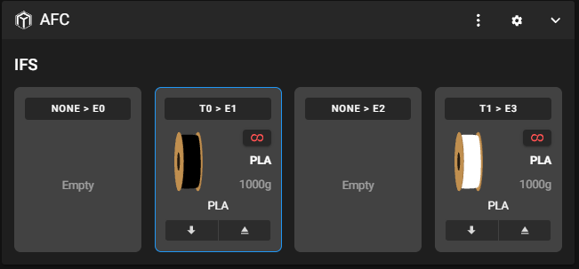
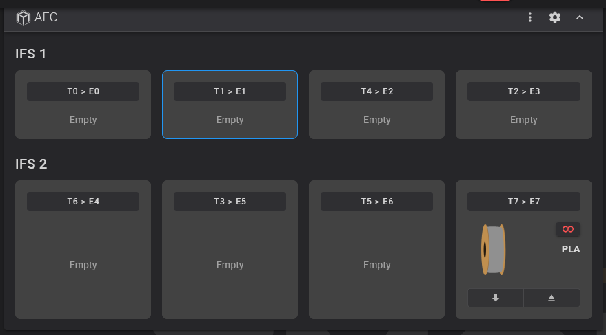
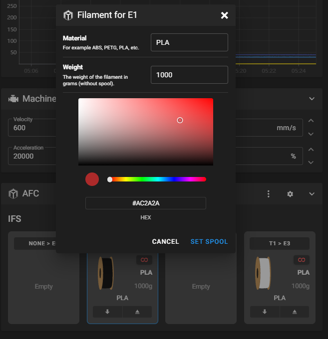

# Zmod AFC Lite

An independent AFC-compatible status and control adapter for **Zmod on
Flashforge AD5X with its four-slot IFS**. It is not a port for the Snapmaker U1
firmware.

The status shape follows the [AFC-Lite stub contract](https://snapmakeru1-extended-firmware.pages.dev/afc-lite);
the hardware and metadata calls are adapted to [Zmod AD5X](https://github.com/ghzserg/z_ad5x).

The plugin presents Zmod IFS slots 1-4 as AFC lanes E0-E3. All lanes use the
AD5X's single Klipper `extruder`; Zmod's `zmod_color` and `zmod_ifs` objects
provide filament presence, current slot, color, and material information.

## Screenshots

The plugin works with the AFC panels in both Mainsail and Fluidd; these
screenshots are from Mainsail.

The AFC panel with the AD5X IFS. Each lane shows its per-print tool mapping,
and the active slot is outlined:



With the IFS Jacker plugin, each chained IFS gets its own unit of four lanes:



Clicking a spool opens the filament dialog. The weight is prefilled, so only
the material and color need picking:



## Supported

- AFC-style status for the four Zmod IFS slots.
- Load/unload through Zmod's native `IN_ZCOLOR` command.
- Color/material updates through Zmod's native `CHANGE_ZCOLOR` command.
- Current logical tool display from Zmod's per-print `file.json` mapping.
- Chained IFS units through the [IFS Jacker plugin](https://github.com/ninjamida/ifs_jacker_plugin):
  while it is loaded, every channel it detects becomes a lane, grouped four per
  unit (`IFS_1`, `IFS_2`, ...). Without it, the plugin shows the single `IFS`
  unit with four lanes. Up to 16 lanes update live; channels beyond that appear
  after reloading Mainsail or Fluidd.
- OrcaSlicer filament sync: slot colors and materials are mirrored into
  Moonraker's `lane_data` namespace (see below).

## OrcaSlicer lane data

OrcaSlicer reads each slot's filament from Moonraker's `lane_data` database
namespace. Whenever a slot's color or material changes in Zmod (from the AFC
panel in Mainsail or Fluidd, the printer screen, or the `COLOR` macro), the plugin updates that
slot's `laneN` entry, where `N` is the 1-based slot number and `lane` holds the
0-based slot index as a string.

On the AD5X, HelixScreen and SpoolSync also keep `lane1`..`lane4` there, so
the plugin only merges `color` and `material` into existing entries and
leaves temperatures and other tools' fields alone. It skips color or material
when HelixScreen has locked them (`helix_locked_color`,
`helix_locked_material`), and after the first sync it writes a lane only when
Zmod's own data for it changes. It deletes only `laneN` entries it created
itself, once their slot no longer exists (e.g. an IFS Jacker unit is removed).

Options in the `[zmod_afclite]` section:

```ini
[zmod_afclite]
lane_data: True                         # set False to disable the sync
moonraker_url: http://127.0.0.1:7125    # Moonraker as seen from Klipper
default_weight: 1000                    # grams shown for lanes without a weight
```

## Material selection

The filament dialog's material field in Mainsail and Fluidd is a free-text
box; the plugin cannot turn it into a dropdown. Instead it shows a material
picker: a prompt with one button per material in the printer's own list
(`valid_types` reported by Zmod: the built-in types plus any custom
`filament_<NAME>` entries in `[zmod_ifs]`, without the ones in
`hide_filament_types`).

- Pick a color and press **Set Spool** without touching the material box: the
  color is applied and the picker opens. Choose a material, or **Keep** the
  current one.
- Type an exact name, in any case (`petg`): it is applied directly and the
  picker closes.
- Type part of a name (`pet`, `cf`): the picker shows only the matching
  materials.
- Type anything else (a typo): the picker shows every material.

To stop the picker opening after every color change, add this to
`mod_data/user.cfg`:

```ini
[gcode_macro SET_COLOR]
variable_material_prompt: False
```

## Filament weight

Zmod does not measure filament. The filament dialogs in Mainsail and Fluidd
will not apply a color or material until the lane has a weight, so every lane reports
`default_weight` (1000 g) until you enter one. A weight entered in the dialog
(`SET_WEIGHT`) is saved per lane in `save_variables` as
`zmod_afclite_weight_<lane>` and survives reboots. Set `default_weight: 0` to
hide weights, at the cost of entering one each time you pick a filament.

## Not supported

- AFC hubs, buffers, runout routing, Spoolman, vendor, spool ID, and weight.
- AFC's global lane-to-tool mapping. Zmod selects mappings per print through
  its own `COLOR` workflow; `SET_MAP` reports an explicit error rather than
  changing a different mapping.
- Running on Zmod models other than AD5X, or on stock Snapmaker U1 firmware.

## Install

Add the section in `zmod_afclite.moonraker.conf.example` to Zmod's
`mod_data/user.moonraker.conf`. It points at
<https://github.com/DIEHARDave/zmod_afclite>; adjust the plugin path if your
Zmod installation uses another plugin directory. Then run:

```gcode
ENABLE_PLUGIN name=zmod_afclite
```

Zmod runs `install.sh`, which adds only the uniquely named
`zmod_afclite.py` symlink to Klipper's extras directory. This keeps the plugin
code in its own update-managed repository and does not replace files in Zmod,
Klipper, or the generic `AFC*.py` module names. The script supports the Native
Klipper and Klipper 13 extras paths documented by Zmod.

Zmod loads `zmod_afclite.cfg` as a normal plugin configuration. That file loads
the namespaced `[zmod_afclite]` module; the module registers the AFC status
objects at runtime. If an AFC object with one of the required names already
exists, startup stops with a conflict error rather than replacing it.

To remove it:

```gcode
DISABLE_PLUGIN name=zmod_afclite
```

The uninstall script removes only this plugin's namespaced link and exact
legacy links from the previous installer version. It never removes regular
Klipper/Zmod files or links owned by another plugin.

## Releases

The update-manager entry uses `channel: stable`, so printers update to the
newest **version tag**, not the newest commit on `main`. Zmod resets plugin
checkouts to that tag. To ship changes, tag the commit and push the tag:

```sh
git tag -a v0.1.1 -m "v0.1.1"
git push origin v0.1.1
```

After the update, run `REBOOT` rather than `FIRMWARE_RESTART`: Klipper keeps
already-imported Python modules, so only a full restart loads the new
`zmod_afclite.py`.

## Verify

The plugin lives and updates under its own Moonraker update-manager entry. It
does not patch Zmod's source, bundled Klipper modules, or printer configuration
outside its plugin config. Compatibility with the AFC panels in Mainsail and
Fluidd necessarily uses the standard
public Klipper objects and macros (`AFC`, `AFC_lane`, `CHANGE_TOOL`, and
related names); do not enable another AFC implementation at the same time.

After Klipper restarts, check that the AFC panel in Mainsail or Fluidd shows
lanes E0-E3. Try a
non-destructive status query before using the load/unload controls. The
adapter requires the Zmod AD5X Klipper objects `zmod_color`, `zmod_ifs`,
`IN_ZCOLOR`, and `CHANGE_ZCOLOR`.
